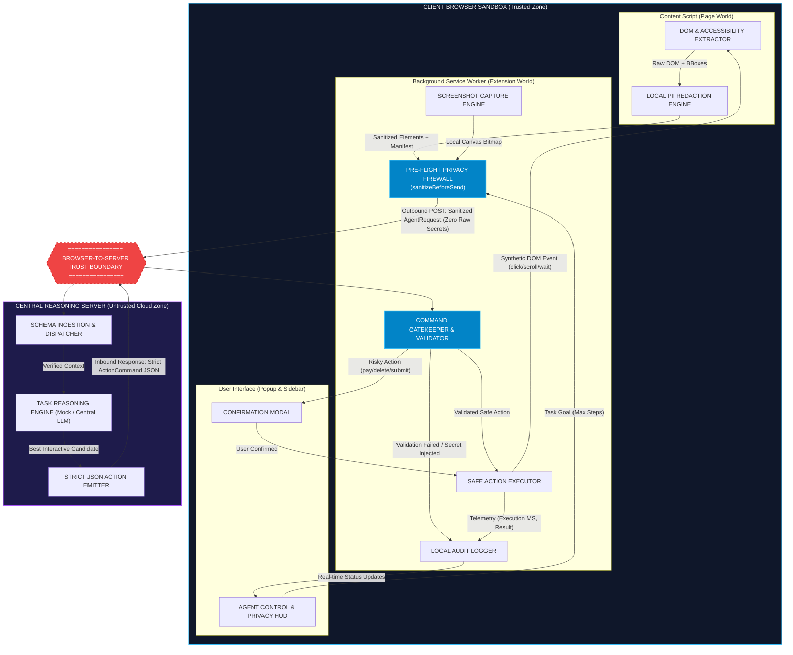

# PrivacySight Agent — Architecture & Data Flow Diagram
**Project:** SIH26171 — On-device Visual Perception for Lightweight Browser Agents  
**Focus:** PowerPoint Box Titles, Connection Labels, One-Line Descriptions, and Trust Boundary

---

## 1. Visual Architecture Diagram

---

## 2. PowerPoint Box Titles & Specifications

Use the following exact titles, descriptions, and colors when transcribing to presentation slides:

| # | Exact Box Title in Slide | Subtitle / One-Line Description | Subsystem Location | Fill Color Suggestion |
| :-: | :--- | :--- | :--- | :--- |
| **1** | **DOM & Accessibility Extractor** | Walks active DOM and accessibility tree to produce normalized interactive element nodes. | Client (Content Script) | Dark Slate (`#1e293b`) |
| **2** | **Local PII Redaction Engine** | Detects sensitive text, phone numbers, PAN, Aadhaar, credit cards, and substitutes masks. | Client (Content Script) | Navy Blue (`#1e3a8a`) |
| **3** | **Screenshot Capture Engine** | Captures visible tab canvas locally without transmission to remote infrastructure. | Client (Service Worker) | Dark Slate (`#1e293b`) |
| **4** | **Pre-Flight Privacy Firewall** | Validates context, computes manifest, and halts outbound dispatch if unredacted data exists. | Client (`sanitizeBeforeSend`) | Cyber Cyan (`#0284c7`) |
| **5** | **Agent Control & Privacy HUD** | Popup/Sidebar UI displaying real-time goals, step counts, and active redaction counts. | Client (UI Extension) | Dark Teal (`#0f766e`) |
| **6** | **Confirmation Modal** | Prompts explicit human confirmation whenever risky action patterns (pay, delete) trigger. | Client (UI Extension) | Amber Warning (`#d97706`) |
| **7** | **Command Gatekeeper & Validator** | Schema-validates server actions, enforces allowlist, and rejects arbitrary scripts or stale IDs. | Client (Service Worker) | Cyber Cyan (`#0284c7`) |
| **8** | **Safe Action Executor** | Dispatches deterministic, synthesized DOM events (click, scroll, wait) to verified target nodes. | Client (Content Script) | Emerald Green (`#059669`) |
| **9** | **Local Audit Logger** | Records immutable timestamped traces of action results with secret values strictly excluded. | Client (Service Worker) | Charcoal (`#334155`) |
| **10** | **Central Reasoning Server** | Ingests sanitized context and computes next optimal action without seeing private user data. | Remote Cloud (`/api/agent`) | Royal Purple (`#581c87`) |

---

## 3. Explicit Arrow & Connector Labels

| From Box | To Box | Exact Arrow Label | Data Payload Transferred |
| :--- | :--- | :--- | :--- |
| **Box 1** (DOM Extractor) | **Box 2** (Redaction Engine) | `"Raw DOM Snapshot"` | Element tag, role, raw visible text, attributes, bounding box |
| **Box 2** (Redaction Engine) | **Box 4** (Privacy Firewall) | `"Sanitized Context"` | Elements with placeholders (`[EMAIL]`, `[PHONE]`), `redaction_manifest` |
| **Box 3** (Screenshot Capture) | **Box 4** (Privacy Firewall) | `"Local Image Bitmap"` | Client-side base64 bitmap with resolution and SHA-256 fingerprint |
| **Box 5** (Control HUD) | **Box 4** (Privacy Firewall) | `"Task Specification"` | Goal string, allowed action types allowlist, maximum step limit |
| **Box 4** (Privacy Firewall) | **Box 10** (Central Server) | **`"Sanitized AgentRequest (OUTBOUND)"`** | **CROSSES TRUST BOUNDARY:** Schema-strictly validated request (zero raw secrets) |
| **Box 10** (Central Server) | **Box 7** (Command Gatekeeper) | **`"Strict ActionCommand (INBOUND)"`** | **CROSSES TRUST BOUNDARY:** Allowlisted JSON command (`click`, `scroll`, `wait`, `observe`) |
| **Box 7** (Gatekeeper) | **Box 6** (Confirmation Modal) | `"Confirmation Required"` | Target element text, action type, reasoning explanation |
| **Box 7** (Gatekeeper) | **Box 8** (Action Executor) | `"Validated Safe Action"` | Target element ID, normalized coordinates, validated arguments |
| **Box 7** (Gatekeeper) | **Box 9** (Audit Logger) | `"Rejection / Error Event"` | Rejection cause (e.g. `unknown action`, `stale element`, `low confidence`) |
| **Box 8** (Action Executor) | **Box 1** (DOM Extractor) | `"Synthetic User Event"` | Dispatches trusted `MouseEvent` or `KeyboardEvent` to resolved DOM element |
| **Box 8** (Action Executor) | **Box 9** (Audit Logger) | `"Action Outcome"` | Timestamp, element ID, confidence score, execution latency in milliseconds |

---

## 4. Browser-to-Server Trust Boundary Specifications

### Permitted Across Trust Boundary (Allowlist Only)
1. **Sanitized DOM Metadata:** Tag names, ARIA roles, normalized coordinates, sanitized visible text containing only category masks (`[EMAIL]`, `[PHONE]`, `[GOV_ID]`, `[FINANCIAL]`, `[PASSWORD]`).
2. **Redaction Manifest:** List of element IDs, fields masked, and PII categories detected.
3. **Execution Metrics:** Milliseconds spent on capture, detection, and redaction.
4. **Task Specifier:** Natural language goal formulated by the user and step constraints.
5. **Returned Server Action:** Strictly bounded JSON object containing:
   - `type`: Must be one of `['click', 'scroll', 'wait', 'observe', 'needs_user_input']`
   - `target.element_id`: String identifier
   - `target.bbox`: Four normalized floats in $[0, 1]$
   - `confidence`: Float in $[0, 1]$

### Strictly Prohibited Across Trust Boundary (Blocked & Audited)
1. ❌ **Raw Viewport Pixels:** Raw unredacted screenshot canvases or full-resolution bitmaps.
2. ❌ **Raw Input Values:** Native `.value` contents of form elements or credentials.
3. ❌ **Unredacted Personal Identifiers:** Phone numbers, Aadhaar, PAN, SSNs, credit cards, or dates of birth.
4. ❌ **Executable Code from Server:** Strings attempting JavaScript execution (`execute_javascript`, `eval`, inline scripts).
5. ❌ **Secret Argument Injection:** Inbound argument keys containing `password`, `secret`, `token`, `cookie`, or `auth`.
6. ❌ **Unbounded Coordinates:** Bounding boxes outside the normalized $[0, 1]$ viewport.
