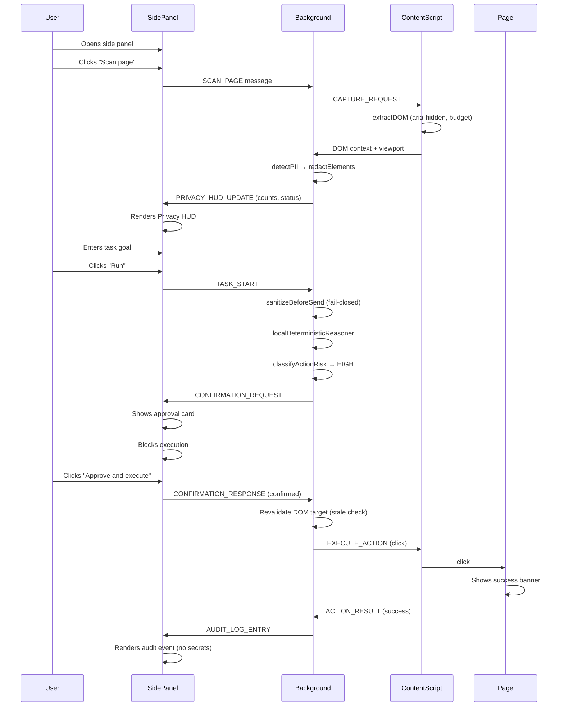

# Architecture Redesign Plan — SIH26171 PrivacySight Agent

> **Goal:** Strongest possible hackathon prototype and presentation.
> **Constraint:** No external repos integrated. Browser Use, PinchTab, TrueForge used as design references only.
> **Status:** PLAN ONLY — no code modified until plan is approved.

---

## 1. Current State Summary

### Existing Modules

| Module | Path | Status | Gap |
|---|---|---|---|
| `packages/protocol` | `types.ts`, `validation.ts` | ✅ Solid | Missing `RiskLevel`, `ApprovalState`, `PrivacyMetadata` types; no payload budget types |
| `packages/privacy` | `pii-detector.ts`, `redactor.ts`, `sanitizer.ts` | ✅ Solid | Missing `sanitizeAccessibleName`, `failClosed` wrapper, `zeroPixelInvariant` export |
| `packages/perception` | `dom-extractor.ts`, `screenshot.ts` | ⚠️ Partial | Missing: aria-hidden filtering, context ranking, payload budgeting, disabled-state detection (partial), deterministic max payload bytes |
| `packages/evaluation` | `index.ts`, `run-evaluation.ts` | ⚠️ Partial | Missing: repeatability (10 runs), action safety metrics, context efficiency metrics, privacy leakage metrics, demo readiness checks |
| `packages/policy` | — | ❌ **Does not exist** | Entire module missing: risk classification, local policy engine, domain policy, confirmation state |
| `apps/extension` | background, content, popup, sidepanel | ⚠️ Functional | Missing: Privacy HUD, approval card UI, "Scan page" button, audit log display, local reasoner label |
| `apps/server` | `index.ts` | ⚠️ Minimal | Mock server exists but is inlined in background.ts; standalone mock server is a stub |
| `fixtures` | `seeded-test-page.html`, `pii-seeded-page.ts` | ⚠️ Basic | Page needs visual polish, explanatory text, success banner improvement |
| Tests | 3 test files, 67 tests | ✅ Solid base | Missing: policy tests, perception budget tests, HUD integration tests, repeatability harness |

### Existing Permissions (Chrome Manifest)

| Permission | Status | Assessment |
|---|---|---|
| `activeTab` | ✅ Keep | Required for `captureVisibleTab` on current tab |
| `tabs` | ⚠️ Review | Needed for `tabs.query` and `tabs.sendMessage`; can't remove |
| `scripting` | ⚠️ Review | May not be needed if content_scripts are declarative-only |
| `storage` | ✅ Keep | Config persistence in `chrome.storage.local` |
| `sidePanel` | ✅ Keep | Required for side panel UI |
| `<all_urls>` host | ⚠️ Reduce | Demo only needs localhost; could narrow for production |

---

## 2. Module Mapping — What Exists vs. What's Required

### packages/protocol — EXTEND

| Required Export | Exists? | Action |
|---|---|---|
| `AgentRequest` | ✅ | No change |
| `AgentResponse` | ✅ | No change |
| `ActionCommand` | ✅ | No change |
| `RiskLevel` | ❌ | **Add** enum: `LOW`, `MEDIUM`, `HIGH`, `BLOCKED` |
| `ApprovalState` | ❌ | **Add** type: `pending`, `approved`, `rejected`, `not_required` |
| `PrivacyMetadata` | ❌ | **Add** interface with HUD display fields |
| `PayloadBudget` | ❌ | **Add** interface: `maxElements`, `maxPayloadBytes`, `retained`, `dropped`, `truncated` |
| Runtime validators | ✅ | Minor extensions for new types |

**Files to change:** `packages/protocol/src/types.ts`, `packages/protocol/src/index.ts`

### packages/privacy — EXTEND

| Required Export | Exists? | Action |
|---|---|---|
| `detectPII` | ✅ (`detectAllPII`) | Alias export |
| `sanitizeDOM` | ✅ (`redactElements`) | Alias export |
| `sanitizeAccessibleName` | ❌ | **Add** function: scrub PII from aria-label/text |
| `verifyNoRawSecrets` | ✅ (in `verifyPrivacy`) | Already checks; export explicitly |
| `sanitizeBeforeSend` | ✅ | No change |
| `failClosed` | ❌ | **Add** wrapper: catches exceptions, returns safe error |
| `zeroPixelInvariant` | ❌ | **Add** assertion function: `image_base64 === ""` |

**Files to change:** `packages/privacy/src/sanitizer.ts`, `packages/privacy/src/index.ts`
**New file:** `packages/privacy/src/invariants.ts`

### packages/perception — EXTEND

| Required Export | Exists? | Action |
|---|---|---|
| `extractInteractiveDOM` | ✅ (`extractDOM`) | Rename/alias |
| `extractAccessibilityMetadata` | ❌ | **Add**: extract ARIA roles, states, properties into structured metadata |
| `stableElementIds` | ✅ | Already implemented in `getOrAssignAgentId` |
| Visibility filtering | ✅ | Already implemented |
| aria-hidden filtering | ❌ | **Add** to `isElementVisible`: check `aria-hidden="true"` ancestors |
| Bounding boxes | ✅ | Already normalized |
| Context ranking | ❌ | **Add**: score elements by task-keyword relevance + interactivity |
| Deterministic payload budgeting | ❌ | **Add**: cap by both element count AND serialized byte size |

**Files to change:** `packages/perception/src/dom-extractor.ts`, `packages/perception/src/index.ts`
**New file:** `packages/perception/src/context-ranker.ts`

### packages/policy — CREATE NEW

| Required Export | Exists? | Action |
|---|---|---|
| `classifyActionRisk` | ❌ | **Create**: action type + target → RiskLevel |
| `evaluateLocalPolicy` | ❌ | **Create**: full policy decision |
| `requiresConfirmation` | ⚠️ exists in protocol/validation | **Move** and enhance with risk levels |
| `allowedActions` | ❌ | **Create**: configurable allowlist |
| `blockedActions` | ❌ | **Create**: `execute_javascript`, `password_fill`, etc. always blocked |
| `navigationPolicy` | ❌ | **Create**: domain allowlist concept (stub for demo) |
| `domainPolicy` | ❌ | **Create**: localhost-only for demo |
| `confirmationState` | ❌ | **Create**: state machine for approval flow |

**New files:**
- `packages/policy/package.json`
- `packages/policy/tsconfig.json`
- `packages/policy/src/index.ts`
- `packages/policy/src/risk-classifier.ts`
- `packages/policy/src/policy-engine.ts`
- `packages/policy/src/blocked-actions.ts`

### packages/extension — MAJOR REFACTOR

| Component | File | Action |
|---|---|---|
| **Background service worker** | `background/index.ts` | Integrate policy engine; use `sanitizeBeforeSend` + policy evaluation; add scan-page handler; extract local reasoner into dedicated function with task-keyword matching |
| **Content script** | `content/index.ts` | Add aria-hidden filtering; add payload budgeting; add scan-only mode (no action) |
| **Side panel** | `sidepanel/sidepanel.ts` | **Rewrite**: Privacy HUD, scan button, task input, approval card, audit log display |
| **Side panel HTML** | `sidepanel.html` | **Rewrite**: full HUD layout with status indicators |
| **Popup** | `popup/popup.ts` | Simplify to link-to-sidepanel; keep minimal |
| **Styles** | `styles.css` | **Extend**: HUD styles, approval card, status badges |
| **Manifests** | `dist/chrome/manifest.json`, `dist/firefox/manifest.json` | Audit permissions; generated by build script |

### packages/evaluation — EXTEND

| Required Feature | Exists? | Action |
|---|---|---|
| Privacy leakage metrics | ❌ | **Add**: raw secrets in payload check, pixel check, password check, cookie/storage check |
| Action safety metrics | ❌ | **Add**: blocked commands, confirmation enforcement, stale rejection, hidden rejection |
| Context efficiency metrics | ❌ | **Add**: original vs retained count, serialized bytes, truncation status |
| Repeatability (10 runs) | ❌ | **Add**: run 10x, report min/max/mean/stddev |
| Demo readiness checks | ❌ | **Add**: build exists, seeded page exists, mock server starts |

**Files to change:** `packages/evaluation/src/index.ts`, `packages/evaluation/src/run-evaluation.ts`

### fixtures — POLISH

| Feature | Action |
|---|---|
| `seeded-test-page.html` | Polish visually; add explanatory banner; add PAN-like ID display; improve success banner with animation; add avatar placeholder |
| `pii-seeded-page.ts` | Update fixture elements to match polished HTML |

---

## 3. Local Reasoner Design

The mock reasoner in `background/index.ts` will be **extracted and enhanced** as a named function with explicit label visibility.

```
localDeterministicReasoner(request: AgentRequest): AgentResponse
```

**Algorithm:**
1. Parse task goal for keywords (e.g., "download", "report", "click").
2. Score each DOM element by:
   - Keyword match in `text`, `aria_label`, `role` (weight: 0.6)
   - Interactive role bonus: button/link (weight: 0.2)
   - Accessible name presence (weight: 0.1)
   - Visibility and non-disabled (weight: 0.1)
3. Select highest-scoring element.
4. Determine action type from task keywords:
   - "click" / "download" / "press" → `click`
   - "type" / "enter" / "fill" → `type`
   - "scroll" → `scroll`
   - "find" / "look" / "check" → `observe`
   - default → `click`
5. Set `requires_confirmation` based on policy engine.
6. Return strictly schema-validated JSON.

**Label:** The side panel will display:
> "Local deterministic reasoner — demo mode"

---

## 4. Policy Engine Design

### Risk Classification Rules

| Action Type | Target Pattern | Risk Level |
|---|---|---|
| `observe`, `wait`, `scroll` | any | `LOW` |
| `click` | non-destructive control (button, link, tab) | `MEDIUM` |
| `click` | download, submit, payment, delete, account, security | `HIGH` |
| `type` | non-sensitive input | `MEDIUM` |
| `type` | password/secret field | `BLOCKED` |
| `keypress` | any | `MEDIUM` |
| `submit` | any form | `HIGH` |
| `execute_javascript` | any | `BLOCKED` |
| any | hidden target | `BLOCKED` |
| any | password_fill, cookie_access, storage_access | `BLOCKED` |
| navigation | any | `HIGH` |

### Server Override Rules
- Server **cannot** lower a risk level.
- Server **cannot** bypass confirmation.
- Server's `requires_confirmation` is OR'd with local policy (never AND'd).

### Demo Configuration
For the seeded demo page:
- "Download Report" button → action `click` → risk `HIGH` → confirmation required.
- User sees the approval card and must click "Approve and execute."

---

## 5. Privacy HUD Design

The side panel will show a compact status display:

```
┌─────────────────────────────────────┐
│ 🛡️ PrivacySight Privacy HUD         │
├─────────────────────────────────────┤
│ Privacy Firewall:    ✅ PASS        │
│ Sensitive items:     5 detected     │
│   email: 1  phone: 1  gov_id: 1    │
│   financial: 1  password: 1        │
│ Raw DOM values sent: ❌ NO          │
│ Raw pixels sent:     ❌ NO          │
│ Cookies/storage:     ❌ NO          │
│ Context: 12/40 retained, 0 dropped │
├─────────────────────────────────────┤
│ Task: Find and click Download Report│
│ Action: click #download-report      │
│ Risk: 🟡 HIGH                       │
│ Approval: ⏳ PENDING                │
├─────────────────────────────────────┤
│ Local deterministic reasoner —      │
│ demo mode                           │
└─────────────────────────────────────┘
```

---

## 6. Approval Card Design

```
┌─────────────────────────────────────┐
│ ⚠️ Action Requires Approval         │
│                                     │
│ Action:  click                      │
│ Target:  Download Report            │
│          #download-report           │
│ Risk:    🟡 HIGH                    │
│ Reason:  This action may create     │
│          a file on the device.      │
│                                     │
│  [Cancel]  [Approve and execute]    │
└─────────────────────────────────────┘
```

No action executes while the card is visible.

---

## 7. Implementation Phases

### Phase A: Policy Engine & Confirmation (Priority 1)

**New files:**
- `packages/policy/package.json`
- `packages/policy/tsconfig.json`
- `packages/policy/src/index.ts`
- `packages/policy/src/risk-classifier.ts`
- `packages/policy/src/policy-engine.ts`
- `packages/policy/src/blocked-actions.ts`

**Modified files:**
- `packages/protocol/src/types.ts` — add `RiskLevel`, `ApprovalState`, `PrivacyMetadata`, `PayloadBudget`
- `packages/protocol/src/index.ts` — re-export new types
- `package.json` — add `packages/policy` to workspaces
- `apps/extension/package.json` — add `@sih26171/policy` dependency

**New tests:**
- `packages/policy/src/__tests__/risk-classifier.test.ts`
- `packages/policy/src/__tests__/policy-engine.test.ts`

**Test cases (minimum):**
1. `observe` → `LOW`
2. `click` non-destructive → `MEDIUM`
3. `click` "Download Report" → `HIGH`
4. `execute_javascript` → `BLOCKED`
5. `submit` → `HIGH`
6. Password-fill attempt → `BLOCKED`
7. Hidden target → `BLOCKED`
8. Server cannot lower risk level
9. Server cannot bypass confirmation
10. BLOCKED actions always fail

**Risk:** Policy module is entirely new. Failure mode: tests fail on risk classification edge cases.
**Mitigation:** Start with a whitelist-based classifier; default to `HIGH` for unknown.

**Demo impact:** This makes "Download Report" show a confirmation card — the strongest demo moment.

---

### Phase B: Perception Pruning & Payload Budget (Priority 2)

**Modified files:**
- `packages/perception/src/dom-extractor.ts` — add aria-hidden filtering, payload byte budget, context ranking
- `packages/perception/src/index.ts` — export new functions
- `apps/extension/src/content/index.ts` — integrate payload budget into extraction

**New file:**
- `packages/perception/src/context-ranker.ts` — keyword relevance scoring

**New tests:**
- `packages/perception/src/__tests__/context-ranker.test.ts`
- `packages/perception/src/__tests__/payload-budget.test.ts`

**Test cases:**
1. Elements with `aria-hidden="true"` are excluded
2. Descendents of `aria-hidden` ancestors are excluded
3. `maxElements = 40` is enforced
4. `maxPayloadBytes = 32768` is enforced
5. Truncation retains interactive elements first
6. Task-keyword matching boosts relevant elements
7. Elements with accessible names rank higher
8. Elements with valid bounding boxes rank higher
9. `context_truncated` flag is set when truncation occurs
10. `retained`/`dropped` counts are accurate

**Defaults:**
```typescript
const PAYLOAD_BUDGET = {
  maxElements: 40,
  maxPayloadBytes: 32 * 1024,  // 32 KB
};
```

**Risk:** Changing extraction defaults from 200 → 40 elements could break existing tests.
**Mitigation:** Make configurable; update fixture expectations.

**Demo impact:** The HUD shows "12/40 retained, 28 dropped" — demonstrates intelligent context pruning.

---

### Phase C: HUD & Seeded-Page Polish (Priority 3)

**Modified files:**
- `apps/extension/src/sidepanel/sidepanel.ts` — **major rewrite** for HUD + approval card
- `apps/extension/src/sidepanel.html` — **major rewrite** for HUD layout
- `apps/extension/src/styles.css` — add HUD styles, approval card styles
- `apps/extension/src/background/index.ts` — add scan-page handler, integrate policy engine, extract local reasoner, broadcast HUD data
- `fixtures/seeded-test-page.html` — visual polish, explanatory text, improved success banner

**New files:**
- `apps/extension/src/sidepanel/hud.ts` — HUD state management (extracted for clarity)

**Test cases:**
1. Scan-page message returns privacy metadata
2. HUD renders correct sensitive item counts
3. Approval card blocks action execution while pending
4. Audit log entries never contain raw secrets
5. Local reasoner returns valid schema for "Download Report" task
6. Local reasoner label is visible

**Risk:** Sidepanel rewrite is the largest UI change. Risk of runtime errors in the extension context.
**Mitigation:** Keep the existing popup as fallback; test sidepanel logic in jsdom first.

**Demo impact:** This is the visible product. The HUD makes the demo visually compelling and the approval card makes the security story tangible.

---

### Phase D: Evaluation & Repeatability (Priority 4)

**Modified files:**
- `packages/evaluation/src/index.ts` — add privacy leakage, action safety, context efficiency, repeatability
- `packages/evaluation/src/run-evaluation.ts` — 10-run loop with min/max/mean/stddev

**New tests:**
- `packages/evaluation/src/__tests__/repeatability.test.ts`
- `packages/evaluation/src/__tests__/action-safety.test.ts`

**Test cases:**
1. Raw DOM secrets in payload: 0
2. Raw screenshot pixels in payload: 0
3. Password values in payload: 0
4. Blocked `execute_javascript` is counted
5. Stale-target rejection is counted
6. 10 runs produce consistent results (stddev < 5%)
7. Retained/dropped counts are accurate
8. Serialized payload bytes are under budget
9. Demo readiness: build exists, seeded page exists

**Risk:** Repeatability may show timing variance across runs.
**Mitigation:** Report actual variance; do not claim deterministic timing.

**Demo impact:** Credible evaluation numbers for the PPT.

---

### Phase E: PPT & Documentation (Priority 5)

**New/rewritten files:**
- `docs/SIH-SIX-SLIDE-CONTENT.md` — **complete rewrite** (6 slides)
- `docs/ARCHITECTURE-DIAGRAM.md` — update with policy engine, HUD, trust boundary
- `docs/PERMISSIONS-JUSTIFICATION.md` — **new**
- `docs/DEMO-CHECKLIST.md` — **rewrite** for new demo flow
- `docs/ADAPTATION-VALIDATION.md` — **new**
- `docs/CLAIMS-AUDIT.md` — **rewrite** with honest measurement boundaries
- `docs/RUBRIC-MAPPING.md` — **rewrite** with new metrics

---

## 8. Complete File Inventory

### New Files (to be created)

| # | File | Phase |
|---|---|---|
| 1 | `packages/policy/package.json` | A |
| 2 | `packages/policy/tsconfig.json` | A |
| 3 | `packages/policy/src/index.ts` | A |
| 4 | `packages/policy/src/risk-classifier.ts` | A |
| 5 | `packages/policy/src/policy-engine.ts` | A |
| 6 | `packages/policy/src/blocked-actions.ts` | A |
| 7 | `packages/policy/src/__tests__/risk-classifier.test.ts` | A |
| 8 | `packages/policy/src/__tests__/policy-engine.test.ts` | A |
| 9 | `packages/perception/src/context-ranker.ts` | B |
| 10 | `packages/perception/src/__tests__/context-ranker.test.ts` | B |
| 11 | `packages/perception/src/__tests__/payload-budget.test.ts` | B |
| 12 | `packages/privacy/src/invariants.ts` | A |
| 13 | `apps/extension/src/sidepanel/hud.ts` | C |
| 14 | `packages/evaluation/src/__tests__/repeatability.test.ts` | D |
| 15 | `packages/evaluation/src/__tests__/action-safety.test.ts` | D |
| 16 | `docs/PERMISSIONS-JUSTIFICATION.md` | E |
| 17 | `docs/ADAPTATION-VALIDATION.md` | E |

### Modified Files

| # | File | Phase | Change Scope |
|---|---|---|---|
| 1 | `packages/protocol/src/types.ts` | A | Add ~50 lines (new types) |
| 2 | `packages/protocol/src/index.ts` | A | Re-export new types |
| 3 | `packages/privacy/src/sanitizer.ts` | A | Add `failClosed` wrapper |
| 4 | `packages/privacy/src/index.ts` | A | Export new functions |
| 5 | `packages/perception/src/dom-extractor.ts` | B | Add aria-hidden, budget (~80 lines) |
| 6 | `packages/perception/src/index.ts` | B | Export new functions |
| 7 | `packages/evaluation/src/index.ts` | D | Add ~150 lines (new metrics) |
| 8 | `packages/evaluation/src/run-evaluation.ts` | D | Add 10-run loop |
| 9 | `apps/extension/src/background/index.ts` | C | Major: integrate policy, local reasoner, scan handler |
| 10 | `apps/extension/src/content/index.ts` | B+C | Add aria-hidden, scan mode |
| 11 | `apps/extension/src/sidepanel/sidepanel.ts` | C | **Rewrite** |
| 12 | `apps/extension/src/sidepanel.html` | C | **Rewrite** |
| 13 | `apps/extension/src/styles.css` | C | Add ~200 lines (HUD, approval) |
| 14 | `fixtures/seeded-test-page.html` | C | Polish, improve success banner |
| 15 | `fixtures/pii-seeded-page.ts` | C+D | Update to match polished page |
| 16 | `package.json` | A | Add policy workspace |
| 17 | `apps/extension/package.json` | A | Add policy dep |
| 18 | `docs/SIH-SIX-SLIDE-CONTENT.md` | E | **Full rewrite** |
| 19 | `docs/ARCHITECTURE-DIAGRAM.md` | E | **Rewrite** |
| 20 | `docs/DEMO-CHECKLIST.md` | E | **Rewrite** |
| 21 | `docs/CLAIMS-AUDIT.md` | E | **Rewrite** |
| 22 | `docs/RUBRIC-MAPPING.md` | E | **Rewrite** |

---

## 9. Risk Register

| Risk | Severity | Probability | Mitigation |
|---|---|---|---|
| Policy module has circular dependency with protocol | Medium | Low | Policy imports from protocol, never the reverse |
| Payload budget breaks existing 67 tests | Medium | Medium | Make budget configurable; update fixture expectations |
| Sidepanel rewrite breaks runtime messaging | High | Medium | Keep popup as fallback; test messaging in isolation |
| Build script doesn't handle new `policy` package | Medium | Medium | Update esbuild config before Phase A tests |
| vitest jsdom environment doesn't support `chrome.runtime` | Medium | High | Already handled by existing test mocks; extend mocks for policy |
| 10-run repeatability shows high variance | Low | Medium | Report actual variance; label as "fixture measurement" |
| aria-hidden filtering reduces element count below demo needs | Low | Low | Demo page has no aria-hidden elements; filtering only helps real pages |

---

## 10. Verification Criteria

After all phases complete, the following must pass:

```bash
# Build
npm run build                          # Zero errors

# Tests
npm test                               # All tests pass, count ≥ 90

# Evaluate
npm run evaluate                       # Score reported with measurement boundary

# Manual demo (if browser available)
# 1. Load extension in Chrome
# 2. Open fixtures/seeded-test-page.html
# 3. Open sidepanel
# 4. Click "Scan page" → HUD shows PII counts
# 5. Enter "Find and click the Download Report button"
# 6. Privacy firewall passes
# 7. Approval card appears (HIGH risk)
# 8. Click "Approve and execute"
# 9. Button is clicked → success banner appears
# 10. Audit log shows events without secrets
```

---

## 11. What This Plan Does NOT Do

- ❌ Does not add Python, Go, Playwright, CDP servers
- ❌ Does not add cloud LLM SDKs
- ❌ Does not add OCR, face detection models, WebGPU
- ❌ Does not add arbitrary JavaScript execution
- ❌ Does not integrate external repository code
- ❌ Does not claim real-world accuracy for synthetic fixtures
- ❌ Does not claim store approval or legal compliance
- ❌ Does not add native messaging
- ❌ Does not request cookies or storage permissions beyond `chrome.storage.local`

---

## 12. Demo Flow (End-to-End)



---

## 13. PPT Slide Map

| Slide | Title | Key Visual |
|---|---|---|
| 1 | Problem & Solution | Before/after: raw data path vs. sanitized data path |
| 2 | Why Existing Agents Are Unsafe | Red path (raw DOM → cloud) vs. green path (firewall → sanitized) |
| 3 | Architecture | Full component diagram with trust boundary |
| 4 | Working Prototype | Screenshot of HUD + approval card + success banner |
| 5 | Feasibility & Evaluation | Test count, build status, fixture score, measurement boundary |
| 6 | Differentiation & Roadmap | P1/P2/P3 phases, references to studied repos |

---

## 14. Estimated Effort

| Phase | Files Created | Files Modified | New Test Cases | Est. Lines |
|---|---|---|---|---|
| A: Policy + Types | 8 | 6 | ~20 | ~600 |
| B: Perception | 3 | 3 | ~10 | ~300 |
| C: HUD + Demo | 1 | 7 | ~6 | ~800 |
| D: Evaluation | 2 | 2 | ~9 | ~250 |
| E: Documentation | 2 | 5 | 0 | ~500 |
| **Total** | **16** | **23** | **~45** | **~2,450** |

Expected final test count: **67 existing + ~45 new = ~112 tests**

---

## 15. Approval Gate

> **This plan is ready for review.**
>
> Proceed with Phase A (policy engine + protocol types) first?
> All subsequent phases depend on Phase A completing successfully.
